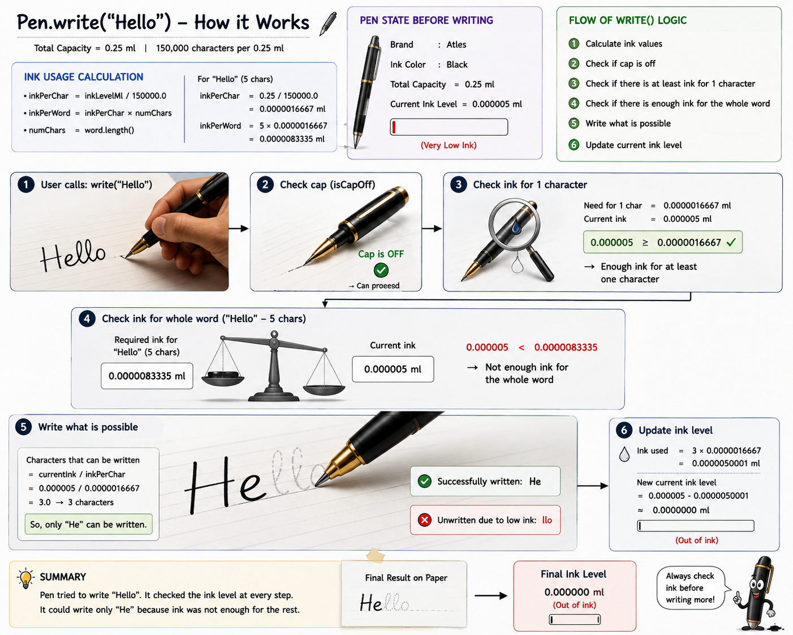

✒️ Object-Oriented Pen Simulation in Java

A simple Java program that simulates a real-world pen. It models physical properties like ink capacity, character-by-character ink consumption, cap status, and handles partial writing when the ink runs low.

✨ Features
Precise Ink Calculation: Calculates ink consumption per character based on a standard pen capacity (0.25ml/150,000 characters).
Cap State Validation: Ensures the pen cannot write unless the cap is removed.
Partial Writing Logic: If the ink is insufficient to complete an entire word, the program calculates how many characters can be written, outputs the written part, stores the unwritten part, and depletes the remaining ink to zero.

